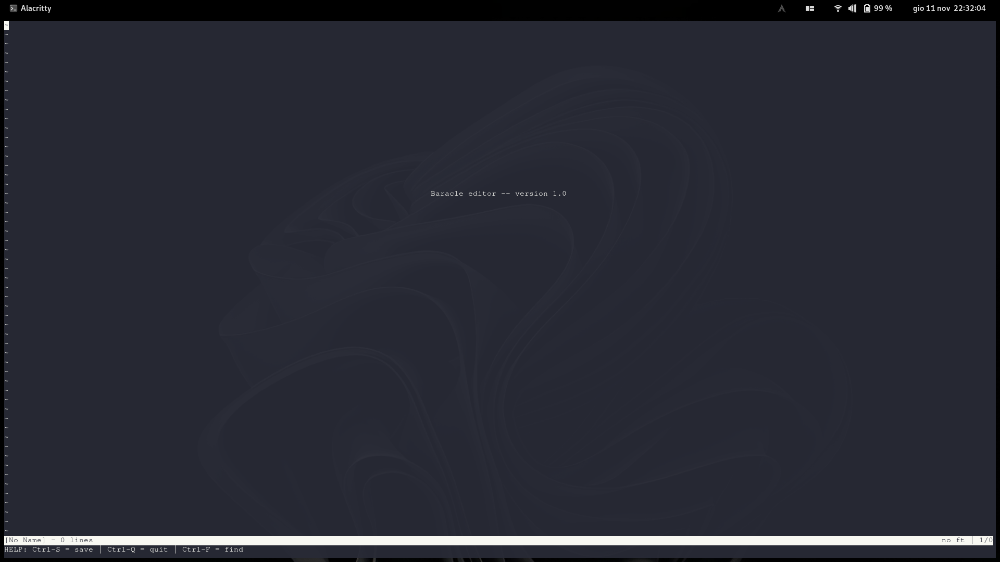

# baracle
Let's make a text editor like in the 70's
 


# Installation

## Arch Linux and derivatives (AUR)

### Stable
package: [baracle](https://aur.archlinux.org/packages/baracle)<br>

Use an [AUR helper](https://wiki.archlinux.org/title/AUR_helpers) or

```bash
git clone https://aur.archlinux.org/baracle.git
makepkg -si
```

## Manual

### Stable

- go to [the releases page](https://github.com/Mirko-r/baracle/releases)
- download the `baracle` of the version you want
- open your terminal in the folder where you downloaded it and run:

```bash
gcc baracle.c -o baracle -Wall -Wextra -pedantic -std=c99
./baracle
```

### Unstable

```bash
git clone https://github.com/Mirko-r/baracle
cd src/
gcc baracle.c -o baracle -Wall -Wextra -pedantic -std=c99
./baracle
